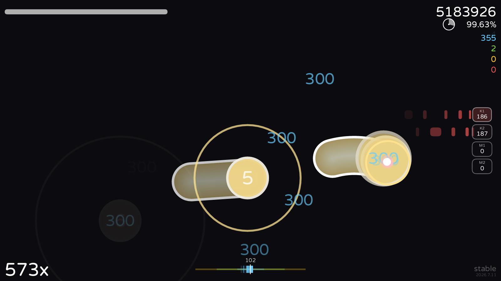

# Dossier

An osu! replay engine, written from scratch: it reads an `.osr`, replays it
against the beatmap, decides what every click was worth, and draws the result
as a video.



[](https://github.com/NaumRedlo/Dossier/actions/workflows/ci.yml)
[](https://github.com/NaumRedlo/Dossier/releases/latest)
[](LICENSE)


> **Рендерите реплеи для бота?** Пошаговая инструкция на русском —
> [onenineeightfour.ignorelist.com/guide](https://onenineeightfour.ignorelist.com/guide).
> Всё остальное здесь по-английски, но по той ссылке этого знать не нужно.

Nothing here wraps the game. The replay parser, the beatmap parser, the
hit-object simulation, the judgement, the renderer and the audio mixer are all
in this repository, in Rust, with no native dependencies at all — which is why
it builds on a Raspberry Pi as readily as on a laptop.

## What is in here

| | |
|---|---|
| `crates/dossier-replay` | `.osr` — the compressed cursor track and what was pressed |
| `crates/dossier-beatmap` | `.osu` and `.osz` — hit objects, timing, slider curves, storyboards |
| `crates/dossier-sim` | replay against beatmap: what actually happened |
| `crates/dossier-assay` | what it was worth: 300s, 100s, misses, the note lock |
| `crates/dossier-render` | frames — skins, cursor, sliders, judgements, the HUD |
| `crates/dossier-audio` | hit sounds, the song, and the mix of the two |
| `crates/dossier-produce` | the scene: finding the map and the skin, drawing it, encoding it |
| `crates/dossier-exhibit` | picking the moments worth showing |
| `crates/dossier-cli` | the `dossier` program |
| `app/` | the desktop application — the engine linked in, with a window |
| `client/` | the Python bridge, and the terminal render client |
| `tools/` | the harnesses: danser's own judge, the corpus, the mod badges |

A replay file records where the cursor was and which buttons were down. It does
**not** record what each click hit — that has to be reconstructed, and doing so
is the difference between rendering a replay and animating a beatmap.

## What it models

| Piece | |
|---|---|
| **Judgement** | Note lock, hit windows, slider heads, ticks, reverses and tails, combo and accuracy — for stable and for lazer, which disagree about several of these |
| **Scoring** | Stable v1 and v2, lazer's own, the difficulty multiplier, and the mod multipliers as they stand after the June 2026 change |
| **Spinners** | Stable's acceleration model, counted in half turns the way `osu!.exe` counts them; lazer's frame-rate-independent spin history; RPM, bonus and Spun Out |
| **Health** | The drain, where a play would have failed, and Easy's two spare lives |
| **Tracking** | The follow circle only opens once a slide has started, and closes the moment the cursor leaves — as stable does it |
| **Rendering** | Playfield transform, combo colours and numbers, approach circles, reverse arrows, sliders that grow in and retract behind the ball, the spinner in osu! pixels, key overlay, storyboards, and a HUD taken off the client's own source |
| **Audio** | The map's own track, plus hit sounds that follow the *judgement* — a missed note is audible by its silence |

## How closely it matches the game

Synthetic tests only say the engine does what its author intended. The thing
that says it is *right* is the `.osr` header, because osu! wrote it: every
replay carries the score it earned, and the engine's totals are held up against
that figure. Where they disagree, the CLI is built to say **where** — which
slider part was dropped, how hits fall around a window edge, which object the
game's extra combo break must have landed on.

As of 9 September 2026, over a corpus of real replays:

```
111 exact of 187 (11 lazer), total count error 188, 3 skipped
score compared on 183, worst 19.89%, within 0.5% on 166
```

"Exact" means every count and the max combo agree with the header, verdict for
verdict. Every judgement rule that changed was measured over that corpus before
and after, and several plausible-sounding changes were reverted because it got
worse. Six rendering optimisations were measured and rejected the same way; the
numbers are kept as `#[ignore]` benchmarks so nobody builds them twice.
[`docs/stable-fidelity.md`](docs/stable-fidelity.md) is where the disagreements
that remain are written down.

## Getting it

**A build to run.** [The latest release](https://github.com/NaumRedlo/Dossier/releases/latest)
is a folder rather than an installer — Windows, macOS on ARM, Linux on x64.
`ffmpeg` is the one thing still to install.

**From source.** Rust, and nothing else:

```
cargo build --release
```

That writes `target/release/dossier`. Try it on a replay:

```
./target/release/dossier judge path/to/replay.osr
```

The desktop application is its own workspace, because Tauri brings several
hundred crates and the engine's tests should not have to look at them:

```
cd app && cargo run
```

## CLI

```
dossier inspect [--json] <replay.osr>...     read the header alone, no map needed
dossier judge   [OPTIONS] <replay.osr>...    judge, and compare with the header
dossier corpus  [OPTIONS] <replay.osr>...    judge a folder of them, against expectations
dossier sliders [OPTIONS] <replay.osr>...    break slider verdicts down by part
dossier errors  [OPTIONS] <replay.osr>...    how hits fall around the windows
dossier score   [OPTIONS] <replay.osr>...    the score, term by term
dossier health  [OPTIONS] <replay.osr>...    where the drain would have killed the play
dossier debug   [OPTIONS] --from <ms> --to <ms> <replay.osr>   one span, object by object
dossier frame   [OPTIONS] --at <ms> <replay.osr>   one frame to PNG
dossier video   [OPTIONS] <replay.osr>       the whole play to MP4
dossier exhibit [OPTIONS] <replay.osr>       the few seconds worth watching, and why
dossier sounds  [OPTIONS] [-o kit.wav]       audition a hit-sound kit
dossier skin    [OPTIONS] -o <folder>        write the skin out for osu! itself
```

Video encoding shells out to `ffmpeg`; frames are piped to it already converted
to YUV, never touching the disk. The rest is 55 crates deep and not one of them
builds C — no `-sys`, no `cc`, no `nasm`, no `pkg-config` — which is the whole
of why the claim above about a Raspberry Pi is a fact rather than a hope.

## Rendering for the bot

The bot at [NaumRedlo/1984](https://github.com/NaumRedlo/1984) takes render
requests from a chat and hands them out to whoever is offering a machine. The
desktop application in `app/` is the friendly side of that; the render client in
`client/` is the same thing in a terminal. It polls, claims a job, renders it and
uploads the video. It needs two lines in `~/.dossier/worker.env`:

```
RENDER_SERVER=https://onenineeightfour.ignorelist.com
RENDER_WORKER_TOKEN=...
```

and then:

```
python client/worker.py --check    # says what is and is not ready
python client/worker.py            # then run it
```

`--check` answers every question at once instead of one failure at a time, and
it reaches the bot without claiming anybody's replay.

It pulls rather than listens, so nothing has to be reachable from outside: no
port is opened and the address may move. How hard it works is not the client's
decision either — it reads the battery, the energy mode, whether anyone is at
the keyboard and whether the machine is hot, and will refuse work rather than
make a laptop unpleasant to sit in front of.

Windows, macOS and Linux, including ARM.

## Licence, and what in here is not ours

The code is **AGPL-3.0-only**. See [LICENSE](LICENSE).

Two sets of files in this repository are somebody else's work and keep their own
terms:

- **The typefaces.** Varela Round, Commissioner, M PLUS Rounded 1c and JetBrains
  Mono, all under the SIL Open Font License 1.1, each with its licence text
  beside it in `assets/fonts/`.
- **The mod badges.** Twenty-four drawings from [SVG Repo](https://www.svgrepo.com).
  [`assets/mods/README.md`](assets/mods/README.md) names the author of every one
  of them, and so does the application, on its authorship page.
